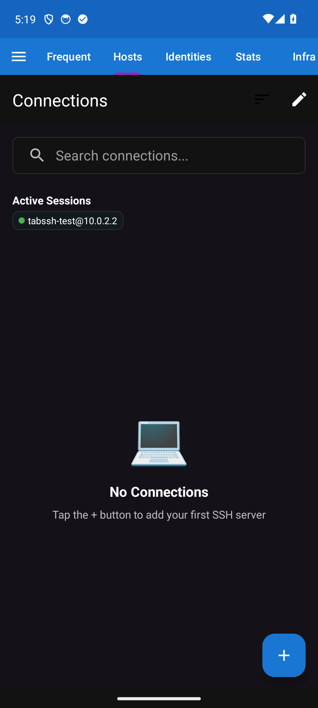
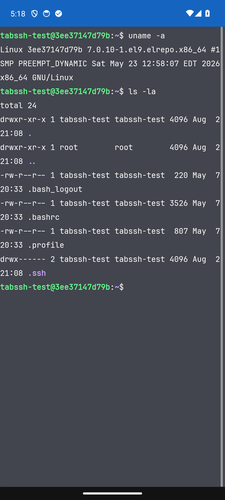
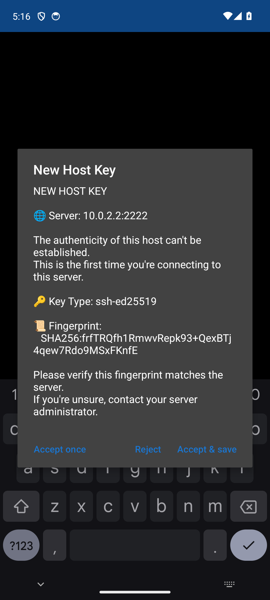
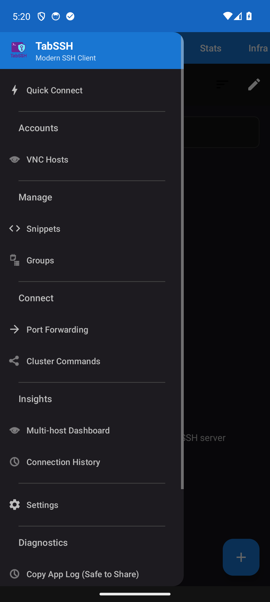
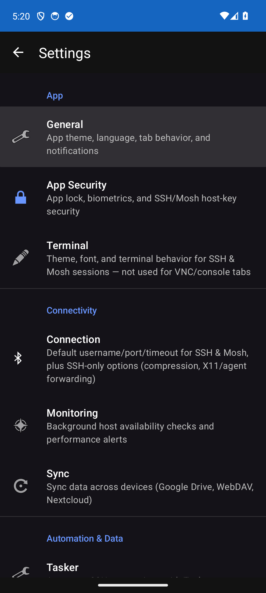

# 📱 TabSSH — Modern SSH Client for Android

A beautiful, modern, open-source SSH client for Android with true browser-style tabs,
enterprise security, hypervisor management, and cloud provider integration. Android is
the reference implementation of the TabSSH ecosystem: [TabSSH Desktop](https://github.com/tabssh/desktop)
(Windows/macOS/Linux/BSD) and [TabSSH Web](https://github.com/tabssh/web) (self-hosted
browser client) are siblings that track this app's connection/backup/sync formats,
QR pairing payload, and built-in theme catalogue byte-for-byte, so a connection vault
created, synced, or paired on any one of the three works unmodified on the other two.

[](https://developer.android.com)
[](https://github.com/tabssh/android/blob/main/LICENSE.md)
[](https://github.com/tabssh/android/releases/latest)
[](https://developer.android.com/tools/releases/platforms)
[](https://github.com/tabssh/android/actions/workflows/ci.yml)
[](https://github.com/tabssh/android/releases)

---

## 📸 Screenshots

| Connections | Terminal | Host Key (TOFU) | Navigation | Settings |
|:---:|:---:|:---:|:---:|:---:|
|  |  |  |  |  |

---

## ✨ Features

### Core SSH

- 📑 **Browser-Style Tabs** — Multiple concurrent SSH sessions; each tab gets its own `ChannelShell` on a shared JSch session
- 🔐 **Auth Methods** — Password, public key (RSA/ECDSA/Ed25519/DSA), keyboard-interactive
- 🔑 **Universal Key Support** — OpenSSH, PEM, PKCS#8, PuTTY; import or generate in-app
- 🖥️ **Full Terminal Emulation** — Termux TerminalEmulator (VT100/ANSI, 256 colors, vim/htop/tmux fully functional)
- 📁 **Integrated SFTP** — File manager with upload/download progress, remote editor, chmod
- 🧭 **Routing & Forwarding** — Reusable proxy / jump-host routes picked per-connection or set as a global default, plus local/remote/dynamic (SOCKS5) port forwards, all in one section
- 🧅 **Tor** — Route SSH through Tor via an Orbot preset or a built-in bundled `tor` loopback SOCKS proxy (no separate app needed)
- 🖼️ **X11 Forwarding** — Run graphical apps remotely via Termux:X11 or XServer XSDL
- 🌐 **SSH Config Import** — `~/.ssh/config` with RemoteCommand, SendEnv, RequestTTY, ProxyJump
- ❤️ **Always-on Keepalive** — 60s serverAliveInterval; idle sessions survive carrier NAT and Wi-Fi sleep
- 🚀 **Tmux/Screen auto-launch** — Per-profile auto-attach/create for tmux/screen/zellij + postConnectScript
- ⌨️ **Per-host PRE-key bindings** — Override the tmux/screen/zellij PRE prefix independently per host; blank falls back to the global default
- 🌐 **IPv4 / IPv6 selection** — Per-host auto/ipv4/ipv6 with fallback toast
- 🔗 **ProxyJump** — Multi-hop connections through bastion hosts
- ⏺️ **Session Recording** — Capture and replay raw terminal sessions (transcript)
- 🎥 **Session Video Recorder** — Record any tab (SSH, VNC, Panes) to mp4 via screen capture; SSH tabs can also record an asciinema `.cast` alongside it; saved to `Movies/TabSSH` and shareable straight from the stop notification
- 🪟 **Panes** — Up to 6 SSH/Telnet/Mosh sessions tiled in a resizable grid inside one terminal tab; tap a pane to focus it, close individually or as a group (Disconnect All / Keep Running in Background), auto-stacks to a single column on narrow screens

### Security

- 🔒 **Hardware-Backed Encryption** — Android Keystore integration (hardware security module when available)
- 👆 **Biometric Authentication** — Fingerprint and face unlock
- 🔐 **No Plaintext Storage** — All credentials encrypted with AES-256-GCM
- 🛡️ **Host Key Verification** — TOFU with SHA256 fingerprints and MITM detection
- 🚫 **Screenshot Protection** — Prevents sensitive data from leaking to recents or screenshots
- 🔐 **Auto-Lock** — Configurable timeout; session credentials zeroed on background
- 📋 **Clipboard Auto-Clear** — Configurable TTL for pasted passwords

### UI/UX

- 🎨 **Material Design 3** — Google's latest design system throughout
- 🌈 **22 Built-in Themes** — Dracula, Solarized (Light/Dark), Nord, Monokai, One Dark, Tokyo Night, Gruvbox, and 15 more
- 🎨 **Custom Theme Editor** — Full GUI in Settings → Appearance; import/export JSON with WCAG 2.1 contrast validation
- ⌨️ **Custom SSH Keyboard** — 1–5 row on-screen bar optimized for vim/tmux/coding; drag-to-reorder keys within rows
- ⌨️ **Hardware Keyboard** — AltGr distinct from Alt; xterm modifier-encoded arrows (Ctrl-Right = `ESC[1;5C`), HOME/END/PG family
- 🗂️ **Tabs at Top** — TabBar flush at top; no toolbar chrome; navigation drawer via left-edge swipe
- 👆 **Edge-Swipe Tabs** — Single-finger fling within 24dp of left/right edge switches tabs
- 🖱️ **Touchpad-Style Terminal Surface** — right-edge desktop scrollbar (xfce4/konsole-style drag-to-scrub), left-edge mouse-wheel zone (flick = one notch, drag = repeated notches, configurable lines per notch), everywhere else scrolls 1:1 like a trackpad
- 🔁 **Active Sessions Strip** — Running tabs with live OSC 0/2 terminal title and connection-state dot
- 📋 **Copyable Error Dialogs** — Every error dialog has a Copy button for clean bug reports
- 🔍 **Find in Scrollback** — Floating search bar with prev/next, match counter, amber highlights, Ctrl+Shift+F shortcut

### Accessibility

- ♿ **TalkBack** — Full screen reader support
- 🔆 **High Contrast** — Enhanced visibility for low vision users
- 📏 **Adjustable Fonts** — 8–32pt, 8 monospace families (Cascadia Code, Fira Code, JetBrains Mono, and more)
- ⌨️ **Keyboard Navigation** — Fully keyboard-accessible
- 🌐 **Translations** — English, Spanish, French, German

### Advanced

- 📡 **Background Monitoring** — Periodic TCP reachability probes; down/recovery notifications; CPU/memory/disk threshold alerts via SSH; configurable cooldown (15 min–12 h)
- 📱 **Mosh Protocol** — Mobile shell for unstable connections with roaming support
- 💾 **Backup & Restore** — Export/import all settings as encrypted ZIP
- ☁️ **Cloud Sync** — Storage Access Framework (Google Drive, Dropbox, OneDrive, Nextcloud, local — no Google services dependency); AES-256-GCM + Argon2id + 3-way merge with conflict UI
- 🔗 **Cross-Platform Compatible** — sync blobs, encrypted backups, QR pairing payloads, and theme files are byte-compatible with [TabSSH Desktop](https://github.com/tabssh/desktop) and [TabSSH Web](https://github.com/tabssh/web); pair or restore on any of the three and pick up the exact same connections, keys, and settings
- 🏠 **Home Screen Widgets** — Quick-connect from launcher
- 📂 **Connection Groups** — Folders with expand/collapse; group badges in search
- 🔍 **Search & Sort** — Real-time search, 8 sort options
- 📊 **Connection Statistics** — Visible "Connected N times • 2h ago" subtitle with relative last-connected time; connection counts are local-only per-device stats and never overwritten by sync; the Frequent list ranks hosts by a hybrid of usage count and recency decay; VNC hosts, Cloud Account instances, Hypervisor VMs, and Container hosts all track connection count and last-connected too, not just SSH/Telnet/Mosh hosts
- 📝 **Snippets** — Quick command library with `{?name:default|hint}` variable placeholders
- ⏺️ **Macros** — Capture and replay raw byte sequences (escape codes, modifier-composed Ctrl/Alt)
- 🎮 **Automation** — Tasker integration, intent-based actions, deep links
- 📊 **Multi-Host Dashboard** — Side-by-side CPU/memory/disk metrics across hosts; dashboard groups independent from connection groups
- 🗓️ **Domain & VPS Renewal Tracking** — Track domain/VPS renewal dates with CSV/Markdown import-export and reminder notifications as expiry approaches

### Hypervisor Management

Manage virtual machines directly from TabSSH — no separate app required.

- **Proxmox VE** — Full REST API; list/start/stop/shutdown/reboot/reset VMs and LXC containers; serial console (termproxy) with automatic VNC fallback; `last_connected` tracking
- **XCP-ng / Xen Orchestra** — XML-RPC direct host or Xen Orchestra REST + WebSocket; real-time VM state; snapshot/backup operations; pool/host info; auto-detects XO vs. direct
- **VMware vSphere / ESXi** — REST API; auto-detects ESXi vs. vCenter; full VM power management
- **QEMU/libvirt (KVM)** — SSH tunnel to host; `virsh list` domain enumeration; start/shutdown/reboot/hard-reset; VNC console tunnelled over SSH (no VNC port exposure required); SSH fallback via ProxyJump when VNC not configured

> **OCI Compute** has moved to **Cloud Accounts** (see below) for a unified multi-cloud experience.

### Cloud Provider Management ☁️

Manage instances across 8 cloud providers from a single Cloud Accounts screen.

- **DigitalOcean** · **Hetzner** · **Linode** · **Vultr** · **AWS EC2** · **Google Cloud Compute** · **Azure VMs** · **Oracle Cloud (OCI)**
- Live instance state (running / stopped / transitioning) with color-coded status dots
- **Start / Stop** power toggle per instance
- **Restart** (graceful) and **Force Restart** (hard power-cycle) for running instances
- **Connect** shortcut — launches SSH session to running instances with a public IP
- Accounts editable after creation; OCI credentials importable from `~/.oci/config` via file picker

### Container Management 🐳

Portainer-class container management over the SSH connections you already have — no agent, no exposed API port. **Docker, Incus, Podman, and LXC/LXD** are supported at full parity.

- **Containers** section in the Infra tab — add any saved SSH connection as a container host, or give the host its own custom SSH endpoint (address, port, username, password/key/identity — password Keystore-only) kept separate from your connection list; pick the **Engine** (Docker, Incus, Podman, LXC/LXD) the same way you pick a hypervisor type
- **Per-host dashboard** — opens on a Dashboard summarising the host, then Containers, Stacks, Images, Volumes, Networks (Incus/LXC also get Snapshots, Profiles, Projects, since Docker/Podman have no equivalent)
- **Containers** — start/stop/restart/pause/kill/rename/remove, live-follow logs, live stats, inspect
- **Enter Terminal** — one tap opens an exec shell into a container as a normal swipeable terminal tab (shell auto-detected)
- **Images / Volumes / Networks** — list, inspect, create, remove, prune; image pull with per-layer progress
- **Compose stacks, paste-first** — paste a complete `compose.yaml` and it's saved to a configurable remote directory (default `/srv/$USER/compose/{name}`, created automatically) with up/down/pull/restart and per-service status
- **Single-container run configs** — form-based `run.yml` editor mirroring `docker run` flags, with a raw-YAML advanced toggle
- **Watchtower-style updates** — a background worker checks registry digests twice a day (per-host toggle and interval override, at most 2 hosts at a time) and flags stale containers (notification + badge); opt-in per-container auto-recreate updates them unattended with automatic rollback on failure
- **Registry support** — Docker Hub (anonymous token flow) and private registries (Basic/Bearer); credentials stored in the Android Keystore only
- **Hybrid transport** — engine API over an SSH unix-socket forward when sshd allows it (`AllowTcpForwarding` + `AllowStreamLocalForwarding`), automatic fallback to the CLI over SSH exec with actionable hints — works either way
- **Socket auto-discovery** — leave the socket field blank to probe the engine's standard locations and remember what's found, or pin an exact path / `tcp://host:port` / `ssh://user@host` for unusual setups

### VNC Console *(alpha)* 🖥️

Pixel-perfect graphical console access to VMs — no separate VNC viewer required.

- RFB protocol client with Tight, ZRLE, CopyRect, Hextile, CoRRE, RRE encoding support
- ServerFence / ClientFence handshake (required for Proxmox vncproxy)
- ExtendedDesktopSize (SetDesktopSize) resize negotiation
- VNC password authentication with correct DES challenge-response (RFC 6143 §7.2.2)
- Proxmox WebSocket VNC via `vncproxy` API (`websocket=1`) — binary WebSocket frames, no separate port mapping required
- X11 keysym translation from Android `KeyEvent` — all modifier keys (Ctrl, Alt, Shift, Super), F1–F12, arrow cluster, Home/End/PgUp/PgDn
- Custom SSH keyboard bar and system keyboard both work inside VNC sessions
- Tunnelled over SSH for QEMU/libvirt — no VNC port needs to be exposed to the network

---

## 📦 Installation

### GitHub Releases

Download from [Releases](https://github.com/tabssh/android/releases):

| APK | Use case |
|---|---|
| `tabssh-android-universal.apk` | **Recommended** — all devices |
| `tabssh-android-arm64.apk` | Modern 64-bit ARM |
| `tabssh-android-arm.apk` | Older 32-bit ARM |
| `tabssh-android-amd64.apk` | x86_64 (Chromebooks / emulators) |
| `tabssh-android-x86.apk` | x86 32-bit |

1. Download `tabssh-android-universal.apk`
2. Enable **Install from Unknown Sources** in Android Settings → Security
3. Open the APK and tap **Install**
4. Launch TabSSH, grant Storage + Notification permissions
5. Add a connection and connect

### F-Droid

Submission metadata lives in `metadata/`; run `./scripts/prepare-fdroid-submission.sh` to bundle it for upload. Listing pending review.

### Requirements

- **Minimum:** Android 7.0 (API 24)
- **Recommended:** Android 8.0+ (API 26) for best performance
- **Storage:** 50 MB free
- **RAM:** 512 MB minimum

---

## 🚀 Quick Start

```
Add connection → Tap "+" → enter host/port/username → save
Connect        → Tap profile → accept host key → connected
New tab        → Tap "+" in TabBar, or Ctrl+T
SFTP           → Tap the folder icon in an active session
VNC console    → Infra → Hypervisors → tap VM → tap VNC/Console
Cloud          → Cloud Accounts → tap account → view live instances
```

---

## ⚠️ Known Limitations

- **`lastlog`/`lastb` under Mosh** — Mosh sessions won't show the usual "last login" banner. That's upstream `mosh-server` behavior (it starts a fresh PTY session detached from the bootstrapping SSH login), not a TabSSH bug.
- **X11 forwarding on Mosh tabs rides the SSH session, not Mosh's UDP transport** — Mosh only ever carries terminal I/O over UDP; it has no channel of its own for X11. When a Mosh profile has X11 forwarding enabled, TabSSH keeps the bootstrap SSH session open for the life of the tab specifically to carry the `x11-req`/X11 channel, alongside the independent Mosh UDP connection for the terminal itself.

---

## 🔐 Security

**Report vulnerabilities privately via [GitHub Security Advisories](https://github.com/tabssh/android/security/advisories/new)** — reports are encrypted and not visible publicly until a fix is released. See [SECURITY.md](.github/SECURITY.md) for full scope, SLA, and attribution policy.

- AES-256-GCM for all stored credentials
- Android Keystore (hardware-backed when available)
- Host key TOFU with SHA256 fingerprints
- Zero telemetry, zero analytics, zero external network requests except SSH/cloud connections
- Session credentials zeroed from memory when the app backgrounds
- OWASP Dependency-Check in CI

---

## 🎨 Themes

23 built-in themes: **Dracula**, **Solarized Light/Dark**, **Nord**, **Monokai**, **One Dark**, **Tokyo Night**, **Gruvbox**, **Tomorrow Night**, **Catppuccin Mocha**, and 14 more.

**Custom themes:** Settings → General → Appearance → Theme Editor. Import/export JSON:

```json
{
  "name": "My Theme",
  "colors": {
    "background": "#1e1e1e",
    "foreground": "#d4d4d4",
    "cursor": "#00ff00"
  }
}
```

---

## 📊 Stats

| Metric | Value |
|---|---|
| Kotlin files | 411 |
| Lines of code | ~131,000 |
| Activities | 50 |
| Fragments | 24 |
| Services | 2 (`SSHConnectionService`, `VncKeepAliveService`) |
| Built-in themes | 23 |
| Translations | 4 (EN/ES/FR/DE) |
| APK variants | 5 (universal + 4 arch-specific) |
| Hypervisor backends | 4 (Proxmox, XCP-ng, VMware, QEMU/libvirt) |
| Container engines | 4 (Docker, Incus, Podman, LXC/LXD) |
| Cloud providers | 8 (DO, Hetzner, Linode, Vultr, AWS, GCP, Azure, OCI) |
| Room DB version | 24 (21 forward migrations from v2) |
| Trackers | 2 (Domain Tracker, VPS Hosting Tracker) |

---

## 🤝 Contributing

See [CONTRIBUTING.md](.github/CONTRIBUTING.md) for guidelines.

```bash
git checkout -b feature/my-feature
# make changes
make check          # must pass (runs compile + lint + unit tests in Docker)
# open pull request
```

---

## 🙏 Acknowledgments

- **[JSch (mwiede fork)](https://github.com/mwiede/jsch)** — modern SSH2 (chacha20-poly1305, aes256-gcm, curve25519, ed25519)
- **[Termux Terminal Emulator](https://github.com/termux/termux-app)** — VT100/ANSI terminal core
- **[Material Design Components](https://material.io/)** — UI framework
- **[BouncyCastle](https://www.bouncycastle.org/)** — cryptography
- The ConnectBot and JuiceSSH teams for pioneering Android SSH

---

## 💬 Support

- 🐛 **Bugs / Features:** [GitHub Issues](https://github.com/tabssh/android/issues)
- 💬 **Discussion:** [GitHub Discussions](https://github.com/tabssh/android/discussions)
- 📧 **Email:** git-admin+support@casjaysdev.pro

---

## 🛠️ Development

### Prerequisites

**Docker (recommended)**
- Docker 20.10+ and Docker Compose 2.0+

**Local build**
- Android SDK 35 (compile) / 34 (target), JDK 17 (Temurin/OpenJDK), Gradle 8.14.5

### Build Commands

```bash
make build      # Debug APKs → ./binaries/   (~5 min, Docker-cached)
make check      # Compile-only check         (~2 min, Docker-cached)
make install    # Install to connected device
make logs       # Tail logcat
make test       # Run UI tests
make clean      # Remove build artifacts
```

Production releases are built by the `release.yml` workflow on tag push (`v*`).

### Project Structure

```
android/
├── app/src/main/java/io/github/tabssh/
│   ├── cloud/          # Cloud provider clients + CloudInstanceState
│   ├── crypto/         # AES-GCM, Keystore wrappers, key storage
│   ├── hypervisor/     # Proxmox, XCP-ng, VMware, libvirt, OCI API clients
│   ├── ssh/            # SSHConnection, SSHSessionManager, port forwarding, X11
│   ├── sftp/           # SFTP browser and file transfer
│   ├── terminal/       # TermuxBridge, TerminalView, VNC RFB client
│   ├── storage/        # Room DB (v27), DAOs, entities
│   ├── sync/           # SAF-based 3-way merge sync (TABSSH_SYNC_V2, shared
│                       #   with the Desktop and Web sibling apps)
│   ├── backup/         # Encrypted ZIP backup/restore
│   └── ui/             # Activities, Fragments, Adapters, ViewModels
├── app/src/main/res/   # Layouts, strings, themes, drawables
├── app/schemas/        # Room migration JSON schemas
├── .github/workflows/  # CI/CD (ci, security, development, beta, release,
│                       #        mosh-binaries, spice-libs, tor-binaries)
├── docker/             # docker-compose.yml (build/test services)
├── scripts/            # Build and automation scripts
├── metadata/           # F-Droid metadata
├── Makefile
└── release.txt         # Version pin (1.0.0)
```

### 🐳 Docker Build

The build toolchain runs inside Docker — no local Android SDK or JDK required.

```bash
# Build debug APKs
docker compose -f docker/docker-compose.yml run --rm tabssh-build

# Or via make (recommended)
make build
```

The `casjaysdev/android:latest` toolchain image contains the Android SDK, JDK 17, and Gradle. It is maintained externally — this repo builds no toolchain image of its own.

---

## 🌐 Sibling Apps

TabSSH is a three-platform ecosystem; Android is the reference implementation.
Every sync blob, encrypted backup, QR pairing payload, and built-in theme is
byte-compatible across all three, so users can move between platforms freely:

- [**TabSSH Desktop**](https://github.com/tabssh/desktop) — a single static Rust
  binary for Windows, macOS, Linux, and BSD, with system tray, direct `~/.ssh/`
  access, and CLI invocation
- [**TabSSH Web**](https://github.com/tabssh/web) — a self-hosted web client
  (a self-hosted Termius/Termix alternative) for browser access with no install,
  plus server-blind end-to-end encrypted sync and device pairing for the native apps

Changes to the shared sync wire format, QR pairing payload, backup schema, or
theme catalogue must stay compatible with both siblings — see IDEA.md's
"Must be compatible with" section.

---

## 📄 License

MIT — see [LICENSE.md](LICENSE.md).

```
Copyright (c) 2024 TabSSH Contributors
```
